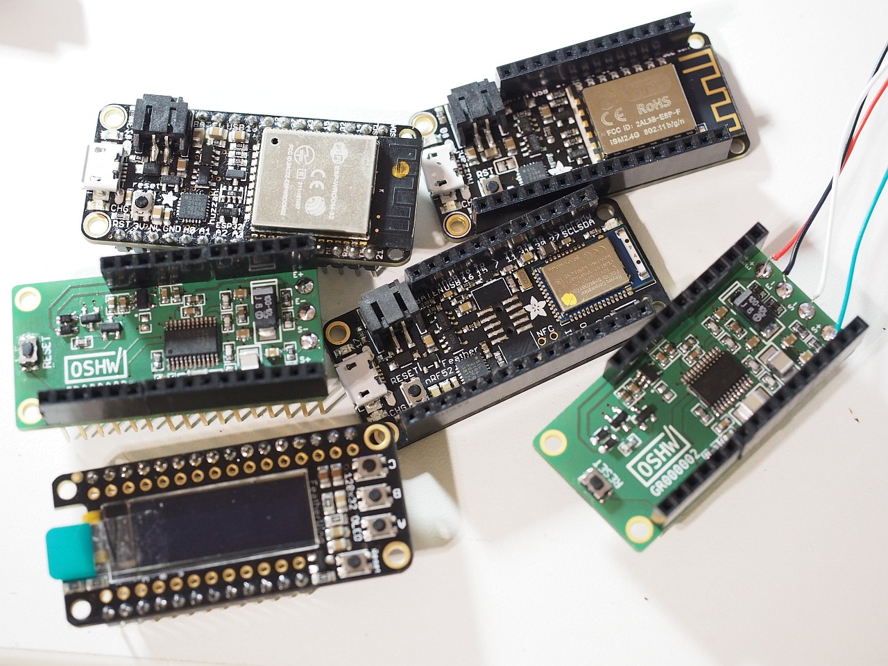

# Scale FeatherWing

**Main repository is on gitlab:
https://gitlab.com/jousis/scale-featherwing

Scale FeatherWing with RC input filter and separate analog LDO. (ADS1232 24-bit ADC)

If you need a full featured plug and play PCB check out espresso-scale:  
https://gitlab.com/jousis/espresso-scale

Stay tuned for  
 - test videos
 - test C++ code (Arduino/PlatformIO) utilizing OLED's buttons (tare/calibrate/speed control)
 - more noise tests with 100/100Ohm RC input filter

**License**  
Software under [LGPL v3] (https://gitlab.com/jousis/scale-featherwing/blob/master/LICENSE)  
Hardware under [CERN Open Hardware Licence v1.2](https://gitlab.com/jousis/scale-featherwing/blob/master/hw-LICENSE)  
Documentation under [CC BY-SA license 2.0](https://creativecommons.org/licenses/by-sa/2.0/)
